# Uber data analysis using R
## Dataset link: [https://www.kaggle.com/datasets/fivethirtyeight/uber-pickups-in-new-york-city](https://www.kaggle.com/datasets/fivethirtyeight/uber-pickups-in-new-york-city)

## Libraries Used
- *ggplot2*: It used for creating aesthetic visualization plots
- *ggthemes*: It is used to create extra themes for plots
- *lubridate*: It is used to convert date and time
- *dplyr*: It is used to perform various operations on dataframes
- *tidyr*: It helps to tidy our data
- *DT*: It helps to interface with the JavaScript Library called – Datatables
- *scales*: Helps to plot graphs with correct scales

## Visualizations
- Plot of trips by the hours in a day
- Plot of total number trips per day of month
- Plot of trips by day and month
- Plot of trips by month
- Plots of trips by bases
- Plot of trips by bases and month
- Plot of trips by bases and day of week
- Heatmap by hours and day
- Heatmap by day and month
- Heatmap by month and day of week
- Heatmap by month and bases
- Heatmap by day of week and bases

## Plots
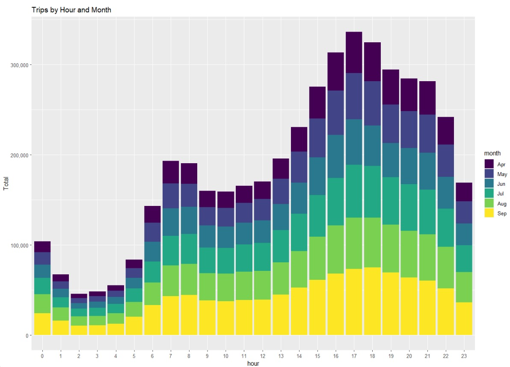
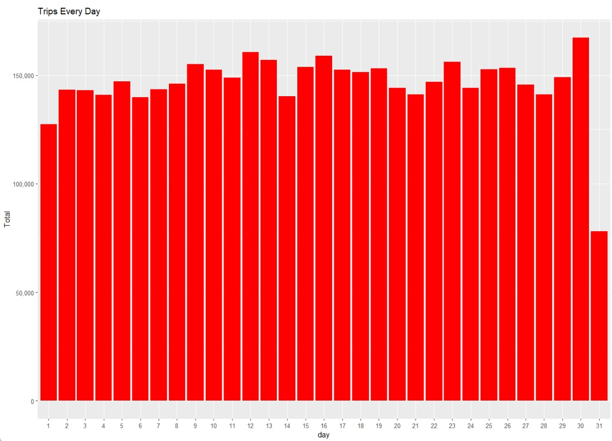
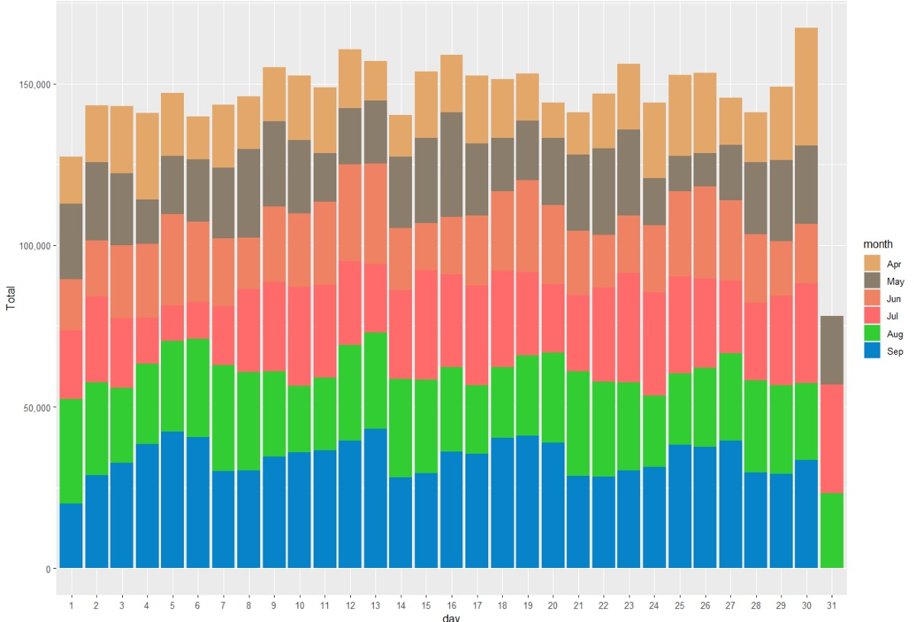

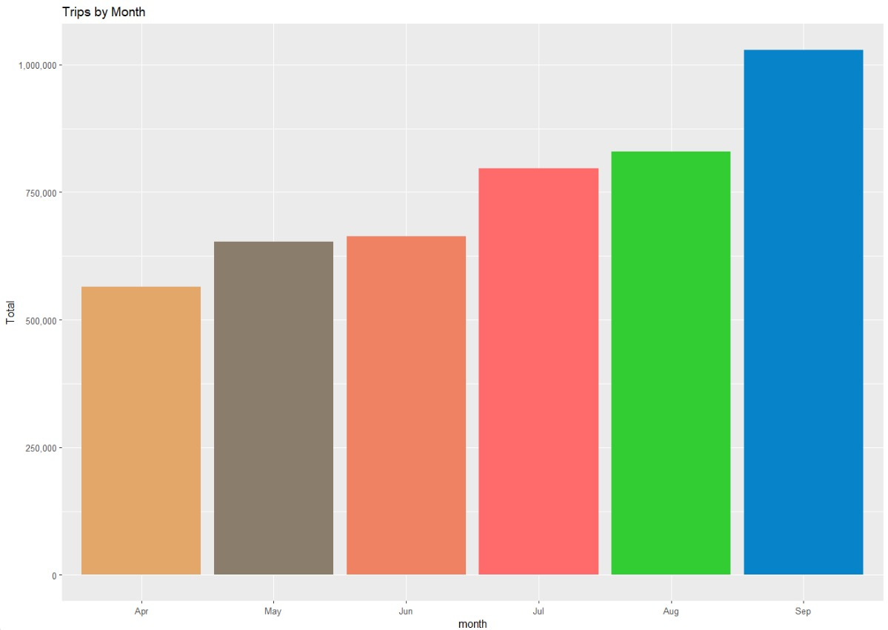
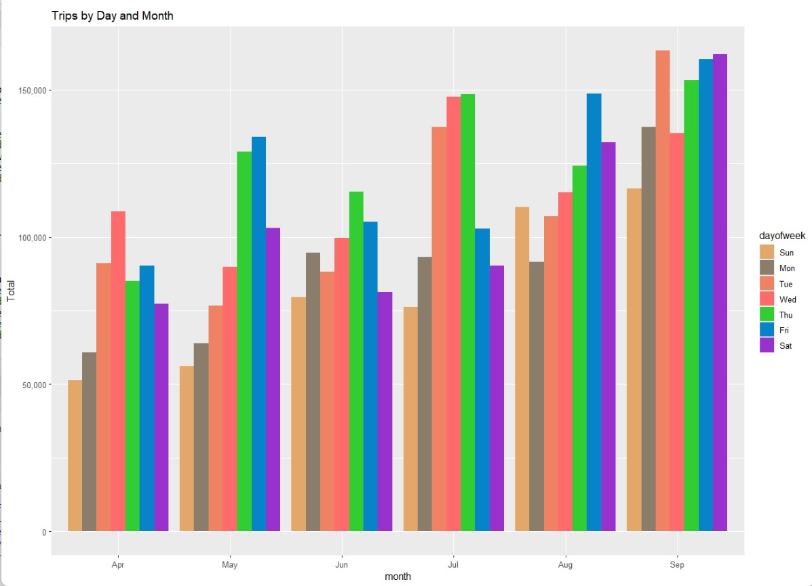
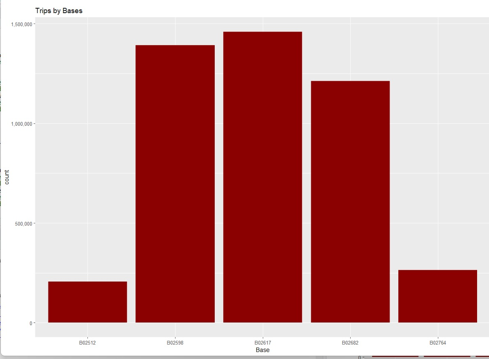
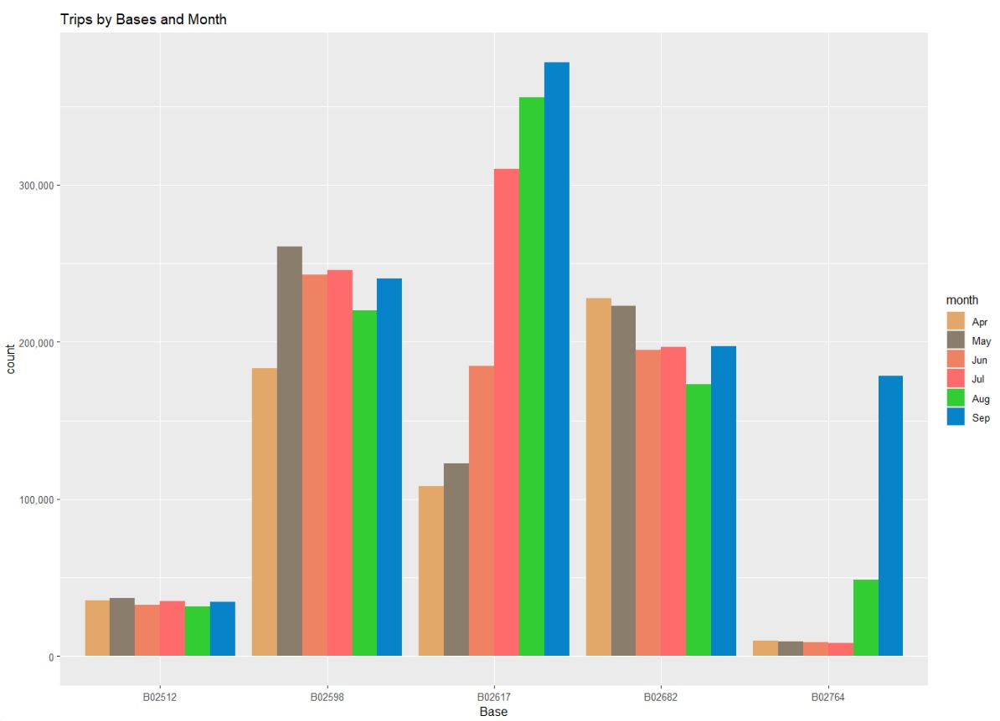
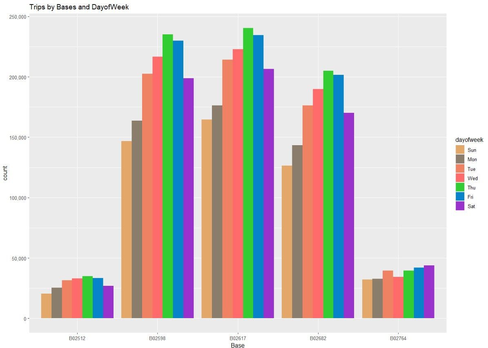
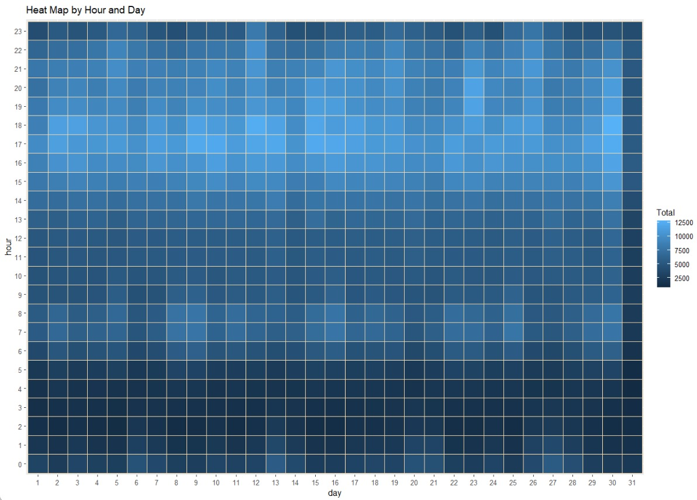

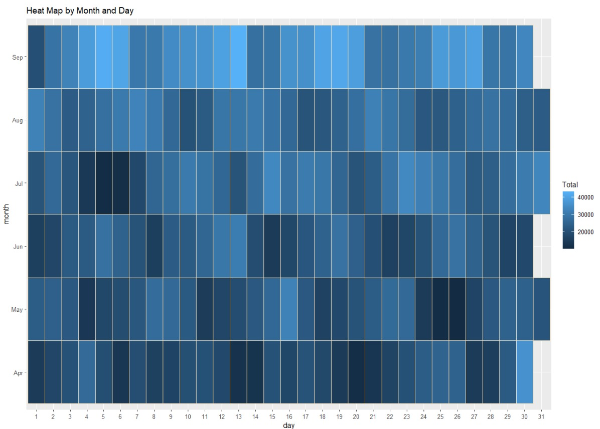
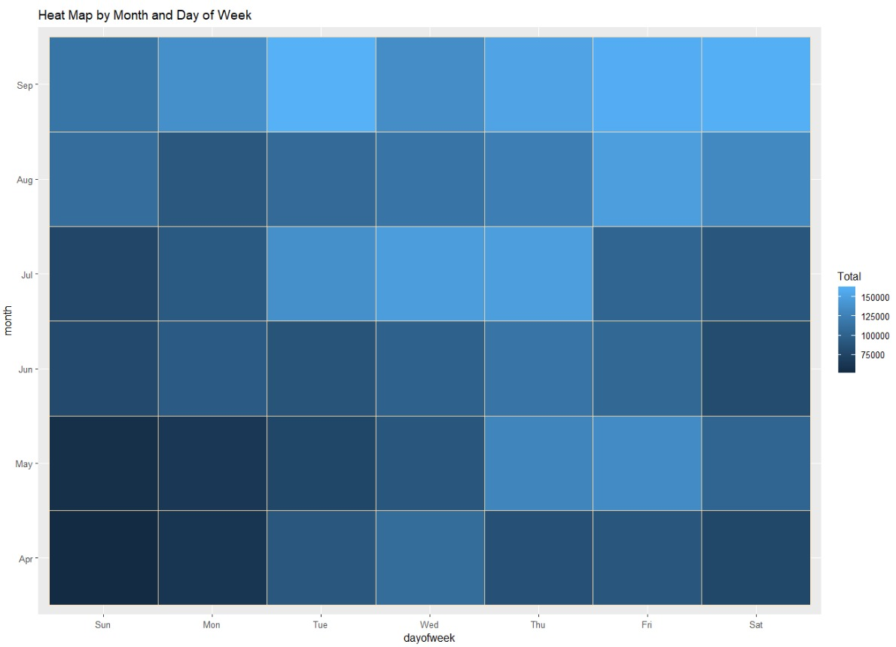
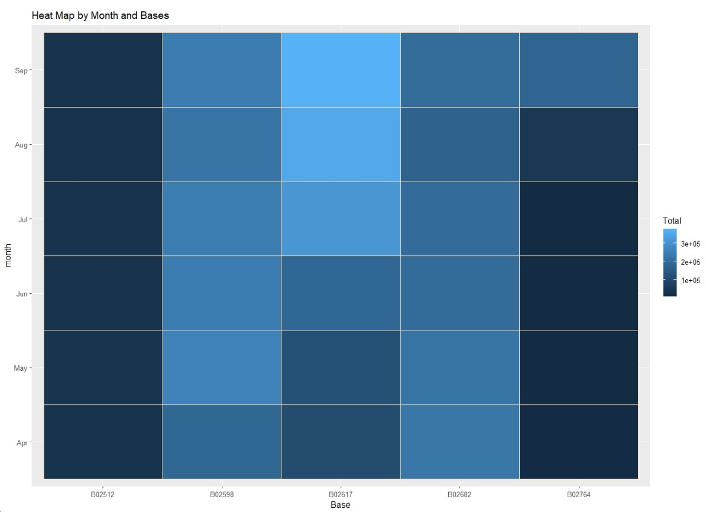
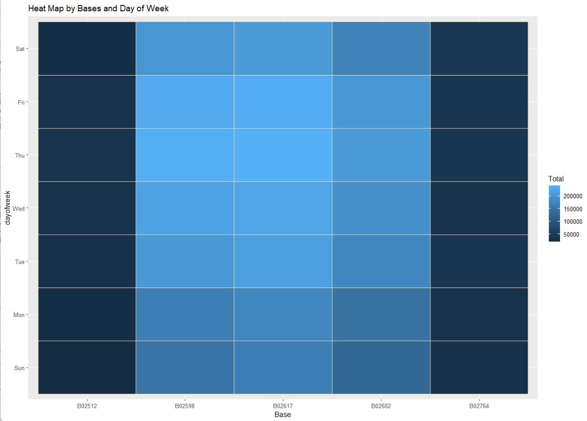